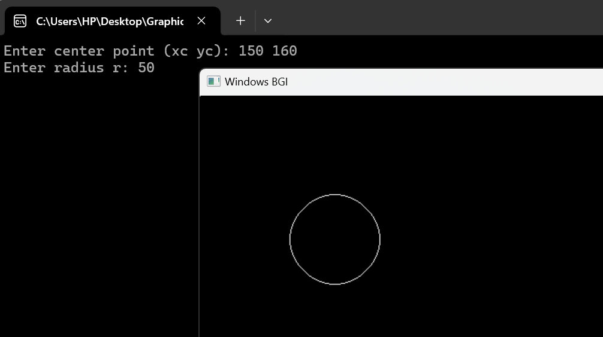

# Bresenham Circle Drawing Algorithm

The **Bresenham Circle Drawing Algorithm** is an efficient method used in computer graphics to draw circles. It uses integer calculations to decide which points of the circle should be plotted, leveraging the symmetry of the circle to reduce computation.

## Algorithm Overview

### Given:
- Center coordinates: `(Xc, Yc)`
- Radius: `R`

### Step 1: Initialize Values

Start at the top of the circle:

- `X = 0`
- `Y = R`

### Step 2: Calculate the Initial Decision Parameter

The decision parameter `P` is calculated as:

- `P = 3 - 2 * R`

### Step 3: Decision Parameter Cases

The algorithm uses two conditions to decide the next point:

#### Case 1: If `P < 0`
- `X = X + 1`
- `P = P + 4 * X + 6`

#### Case 2: If `P ≥ 0`
- `X = X + 1`
- `Y = Y - 1`
- `P = P + 4 * X - 4 * Y + 10`

### Step 4: Plot Symmetrical Points

For each `(X, Y)`, we plot 8 symmetric points using the center `(Xc, Yc)`:

- `(Xc + X, Yc + Y)`
- `(Xc - X, Yc + Y)`
- `(Xc + X, Yc - Y)`
- `(Xc - X, Yc - Y)`
- `(Xc + Y, Yc + X)`
- `(Xc - Y, Yc + X)`
- `(Xc + Y, Yc - X)`
- `(Xc - Y, Yc - X)`

### Step 5: Repeat Until X ≥ Y

Continue calculating points and plotting them until the condition `X ≥ Y` is satisfied.

### Step 6: Generate Points for All Octants

The points calculated in one octant are mirrored across the other seven octants using the symmetry property of the circle.

## Visualization

Here is a visual representation of the algorithm:

[Click here for documentation](https://drive.google.com/file/d/1xi3EISNZUvyKWysvu1nfjrlLNCk59zkq/view?usp=sharing)

